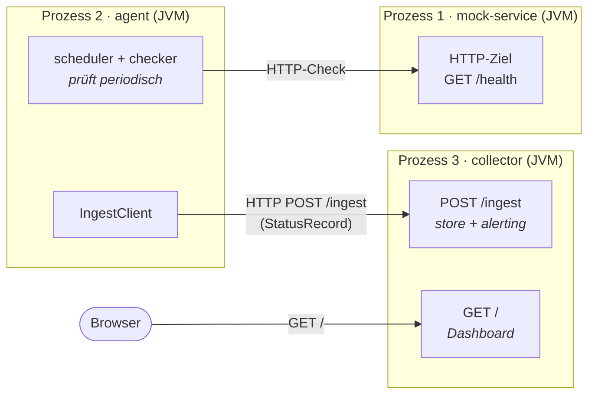
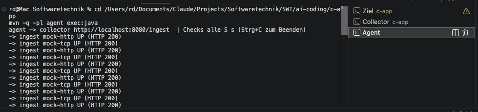
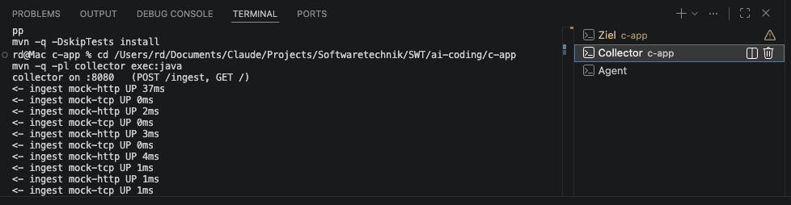
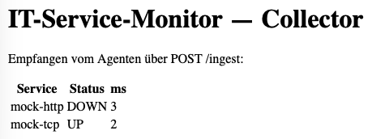

# Verteiltheit — Teil C als verteiltes System

Teil C ist **verteilt** im Sinne der Vorlesung: nicht ein Programm mit
Frontend/Controller/Backend in *einem* Prozess, sondern **mehrere eigenständige
Prozesse (JVMs), die über das Netzwerk kommunizieren**. Ein Prozess erledigt eine
Aufgabe (Prüfen) und **sendet** seine Daten an einen zweiten Prozess, der sie
**verarbeitet** (speichern, alarmieren, anzeigen).

## Die drei Prozesse

| Prozess | Modul | Rolle | Port |
|---|---|---|---|
| 1 | `mock-service` | überwachtes Ziel (HTTP `/health`, Code zur Laufzeit setzbar) | 8081 |
| 2 | `agent` | **Produzent** — prüft periodisch und sendet jedes Ergebnis | — |
| 3 | `collector` | **Verarbeiter** — empfängt, speichert, alarmiert, zeigt Dashboard | 8080 |

## Datenfluss



Zwei Netzwerk-Grenzen: (1) der `agent` prüft `mock-service` per HTTP-Check;
(2) der `agent` sendet jedes Ergebnis per **HTTP `POST /ingest`** an den
`collector`. Drei getrennte JVMs — sichtbar als drei Prozesse in drei Terminals.

## Warum das *verteilt* ist (und Teil B nicht)

- **Teil B / typische „Lösungen":** Frontend + Controller + Backend laufen in
  **einem** Prozess; „verteilt" ist dort nur die Schichten-Trennung im Code.
- **Teil C hier:** `agent` und `collector` sind **getrennte Programme mit eigenem
  `main`**, die **ausschließlich über HTTP** miteinander reden. Der `agent` kann
  auf einem **anderen Rechner** laufen
  (`AgentMain http://<collector-host>:8080/ingest ...`), ohne dass am `collector`
  eine Zeile geändert wird. Genau das ist der Kern: **getrennte Prozesse +
  Nachrichtenaustausch** statt gemeinsamem Speicher.

## Die Naht im Code: `ResultSink`

Der `scheduler` kennt weder `store` noch `alerting` — er übergibt jedes Ergebnis
an einen `ResultSink`. Im verteilten Betrieb ist dieser Sink der `IngestClient`
(HTTP-POST an den `collector`). Dadurch ist derselbe Scheduler **lokal oder
verteilt** einsetzbar; Verteilung ist eine Konfigurations-, keine
Umbau-Entscheidung.

## Protokoll

Ein `StatusRecord` wird als **form-urlencoded** Zeile übertragen — bewusst ohne
JSON-Bibliothek, damit das Protokoll komplett erklärbar bleibt:

```
service=mock-http&status=UP&responseMs=42&timestamp=2026-07-13T10:15:30Z
```

Kodierung/Dekodierung in [`store/IngestCodec`](./store/src/main/java/de/rdbht/swt/monitor/store/IngestCodec.java),
abgesichert durch `IngestCodecTest` (Round-Trip).

## Starten (drei Terminals)

```bash
cd ai-coding/c-app
mvn -q -DskipTests install          # einmalig alle Module bauen/installieren

# Terminal 1 — Prozess 1: das Ziel
mvn -q -pl mock-service exec:java

# Terminal 2 — Prozess 3: der Collector (Dashboard auf :8080)
mvn -q -pl collector exec:java

# Terminal 3 — Prozess 2: der Agent (prüft + sendet)
mvn -q -pl agent exec:java
```

Dann `http://localhost:8080/` im Browser öffnen — der Collector zeigt den Status,
den der Agent **über das Netzwerk** geliefert hat. Ausfall simulieren:

```bash
curl "http://localhost:8081/admin?code=500"
```

→ der nächste Agent-Lauf meldet `DOWN`; nach Ablauf des Fensters feuert der
Collector einen `ALERT` auf der Konsole.

## Nachweis der Verteiltheit (lokaler Lauf)

**Drei laufende Prozesse** (mock-service, collector, agent — je eigener Tab):



**Die Netzwerk-Übergabe** — agent `-> ingest …` und collector `<- ingest …`:



**Collector-Dashboard** (`http://localhost:8080/`) mit den empfangenen Daten:


