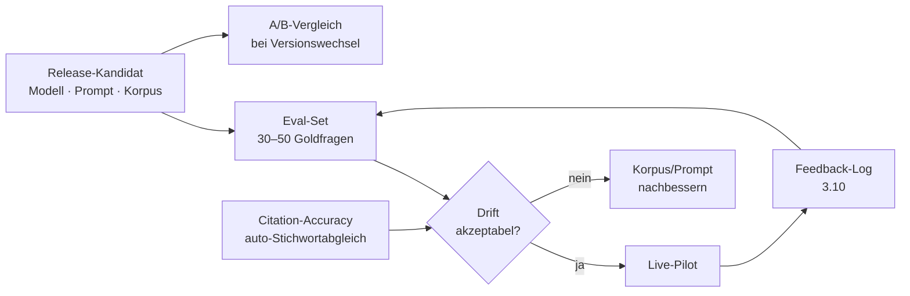

# Teil 2 — AI-Erweiterung (5 Punkte aus Requirements/Analyse)

Erweiterung der Analyse aus Teil 1 um die AI-spezifischen Aspekte, die in der klassischen Software-Checkliste nicht abgedeckt sind. Bezugsprojekt: derselbe Prototyp eines internen AI-Wissensportals für die WBG.

---

## 1. Datenanforderungen

| Aspekt | Anforderung |
|---|---|
| Eingangsformate | PDF, DOCX, Markdown, HTML aus Abteilungsordnern |
| Sprache | primär Deutsch &rarr; multilinguales Embedding-Modell (z. B. `e5-large`) |
| Volumen Pilot | 50–200 Dokumente, kuratiert (vgl. 3.9 R2) |
| Chunking | semantisch, ca. 500–1.000 Token pro Chunk |
| Privacy | Anonymisierung in Vorlagen (Beispielnamen, Mustermieter); Datenminimierung nach DSGVO Art. 5 bereits am Korpus-Eingang |

## 2. Modellrisiken

| Risiko | Charakteristik | Mitigation |
|---|---|---|
| Halluzinationen | besonders bei kleinen deutschsprachigen OSS-Modellen | Pflicht-Quellenangabe (REQ-R1 aus 3.17), niedrige Decoding-Temperatur |
| Bias / Domänenlücke | OSS-Modelle EN-zentriert, WBG-Fachvokabular (WEG, Betriebskosten) schwach abgedeckt | sorgfältige System-Prompts, ggf. Domain-Fine-Tuning in späterer Ausbaustufe |
| Prompt-Injection | Nutzer-Eingabe versucht Systemprompt zu umgehen | Input-Sanitization, klare Rollen-Trennung im Prompt-Template, Output-Filterung |

## 3. Akzeptanzkriterien für AI-Output

Quantitative Mindest-Schwellen für den Übergang Pilot &rarr; Regelbetrieb. Ergänzt durch qualitative Review-Runden zu Tonfall und Verständlichkeit.

| Metrik | Schwelle | Bezug |
|---|---|---|
| Korrektheit gegen Eval-Set | ≥ 80 % | 3.10 |
| Citation-Accuracy (richtige Quelle pro Antwort) | ≥ 90 % | 3.10 |
| Halluzinationsrate | ≤ 5 % | 3.10 |
| Daumen-hoch-Anteil im Live-Feedback | ≥ 70 % | Pilotgruppe |

## 4. AI-spezifische Validierung

Vor jedem Release wird das Eval-Set aus 3.10 wiederholt; bei Modell- oder Prompt-Wechsel zusätzlich A/B gegen Vorversion. Citation-Accuracy läuft automatisiert. LLM-as-a-Judge bewusst nicht im Pilot — Roadmap-Thema mit europäisch gehostetem Judge-Modell.

## 5. Regulatorische Aspekte

| Norm | Anker | Maßnahme |
|---|---|---|
| DSGVO Art. 6 Abs. 1 lit. f | berechtigtes Interesse | Abstimmung mit Datenschutzbeauftragtem |
| DSGVO Art. 28 | Auftragsverarbeitung | ADV-Vertrag mit GPU-Anbieter (RunPod EU-Region) |
| EU AI Act | aktuell niedrige Risikoklasse (keine automatisierten Entscheidungen über Personen) | interner Compliance-Check vor Rollout |
| BetrVG § 87 Abs. 1 Nr. 6 | Mitbestimmung bei techn. Einrichtungen | BR früh einbinden; keine personenbezogene Auswertung im Log |
| Transparenzpflicht | Nutzer muss AI-Interaktion erkennen | sichtbarer Hinweis im UI |
