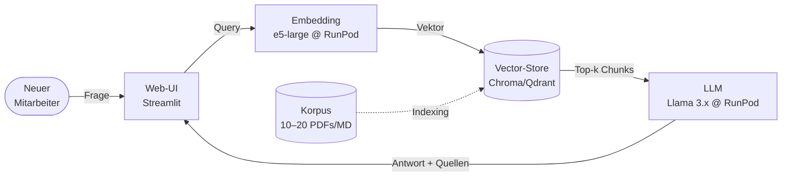

# Teil 1 — Analyse (10 Checklistenpunkte)

Konzeptueller Prototyp eines **internen AI-Wissensportals** für eine mittelständische Wohnungsbaugesellschaft (WBG).

---

## 3.5 Vision und Systemidee

Die WBG erlebt überdurchschnittlich lange Einarbeitungszeiten neuer Mitarbeiter. Organisatorisches Wissen liegt verteilt in Abteilungsordnern und in den Köpfen erfahrener Kollegen; eine konsolidierte, durchsuchbare Prozesslandschaft existiert nicht. Mittelfristig ist zudem der Aufbau einer SharePoint-basierten Stammdatenverwaltung angedacht, für die noch kein Konzept vorliegt.

Vision ist ein **AI-gestützter Onboarding-Assistent**, der Fragen zur Prozesslandschaft per RAG aus der internen Dokumentation beantwortet. Das hinterlegte Wissensmodell entsteht zugleich als Entwurfsgrundlage für die spätere SharePoint-Listenstruktur. Eine Ausbaustufe sieht eine Konzept-Workbench für das Organisations-/IT-Team vor. Erfolgsindikator: kürzere Einarbeitungszeit, weniger Folgefragen bei erfahrenen Kollegen.

## 3.6 Vorstudie und Marktanalyse

Ist-Zustand entspricht einem klassischen **Greenfield-Projekt**: kein dediziertes Wissensmanagement, kein AI-Tooling, Inhalte verstreut auf Abteilungsordner.

| Alternative | Stärke | Schwäche | Bewertung WBG |
|---|---|---|---|
| Microsoft Copilot for M365 | nahtlose Integration | erfordert M365-Stack + Lizenzkosten | später denkbar |
| Glean / Notion AI | Out-of-the-box, gute UX | Datenhoheit, Kosten | wirtschaftlich kritisch |
| Bitrix24 / Personio | HR-Onboarding | kein fachliches Q&A über Prozessdoku | passt nicht |
| **Self-built (OSS + RunPod)** | volle Datenhoheit, niedrige Initialkosten, klare Erweiterung | Eigenleistung in Aufbau | **Empfehlung Pilot** |

## 3.9 Durchführbarkeitsstudie und Risikoanalyse

Technisch ist das Vorhaben gut durchführbar — RAG-Architekturen sind seit 2023 ausgereift, GPU-Inferenz über RunPod wirtschaftlich tragbar. Die wesentlichen Risiken liegen in Datenbasis und Organisation:

| # | Risiko | Mitigation |
|---|---|---|
| R1 | Halluzinationen mit rechtlicher Wirkung (WEG, Mietrecht) | Pflicht-Quellenzitate, Disclaimer bei rechtlich bindenden Themen |
| R2 | Dokumentenqualität ("Garbage-in") | kuratierter Initial-Korpus, Erweiterung erst nach QS |
| R3 | Datenschutz / Datenhoheit | EU-Hosting (RunPod EU), ADV-Vertrag, strikte Datentrennung |
| R4 | Akzeptanz und Mitbestimmung | Pilot mit Kleingruppe, frühzeitige BR-Einbindung |

## 3.10 Konzept der Qualitätssicherung

Pragmatisches QS-Konzept für mittelständische Strukturen ohne dediziertes ML-Team: ein **Eval-Set von 30–50 Goldstandard-Fragen** mit Referenzantwort und erwarteter Quelle, das vor jedem Release wiederholt wird. Drei Metriken: Korrektheit, Zitations-Genauigkeit, Halluzinationsfreiheit. Ergänzend ein Feedback-Button (👍/👎) im UI und ein einfaches Anfragen-Logging zur Erkennung systematischer Korpus-Lücken. LLM-as-a-Judge ist bewusst kein Bestandteil des Pilots.

## 3.11 Technischer Prototyp / Durchstich (Spike)

Ende-zu-Ende lauffähiger Durchstich vor Investition in Breite; bewusst ohne Cloud-LLM (Datenhoheit).



**Erfolgskriterium:** fachlich korrekte Antwort mit klickbarer Quelle in ≤ 5 Sekunden. Authentifizierung, Multi-User, SharePoint-Anbindung sind explizit nicht Teil des Spikes.

## 3.13 Vorgehens- und Prozessmodell

Aus den im Skript als heute relevant genannten Modellen (RUP, XP, Scrum, Crystal Clear) wird **Scrum-Light / Kanban** gewählt — passend zu den drei Skript-Auswahlkriterien Größe (klein), Kultur (kein agiles Reifegrad-Modell vorausgesetzt) und Bereitschaft der Beteiligten (Fachexperten ohne PO-Rolle).

| Phase | Ziel | Dauer | Hauptergebnis |
|---|---|---|---|
| 1 — Spike | technische Machbarkeit (siehe 3.11) | 2–3 Wochen | Architektur-Durchstich, erstes Demo |
| 2 — Pilot | Korpus + UI + Eval-Set, Pilotgruppe 3–5 Personen | 4–8 Wochen | belastbare Pilot-Erfahrungen |
| 3 — Rollout | Aufnahme in Onboarding-Prozess, BR-Vereinbarung | offen | Regelbetrieb, Roadmap Konzept-Workbench |

## 3.15 Stakeholder und deren Interessen

Stakeholder im Sinne des Skripts: Anteilseigner, "für die etwas auf dem Spiel steht".

| Stakeholder | Primäres Interesse | Politische / egoistische Sicht |
|---|---|---|
| Geschäftsleitung | Kosten/Nutzen, Risiko, Außenwirkung | will schnelle sichtbare Erfolge |
| IT-Leitung | Wartbarkeit, Sicherheit, Integration | Sorge vor Wartungslast |
| Abteilungsleiter / Fachexperten | Qualität der eigenen Doku | Wissen als Macht — teilen ungerne |
| Erfahrene Mitarbeitende | Entlastung von Standardfragen | Sorge um Expertenrolle |
| Neue Mitarbeitende (Endnutzer) | schnelle Einarbeitung | — |
| Betriebsrat | Mitbestimmung, Datenschutz | gesetzliche Pflicht, frühzeitig einbinden |
| Datenschutzbeauftragter | DSGVO-Konformität | — |

Mitigationen: Kommunikation "AI als Hilfe, nicht als Ersatz"; BR früh involvieren; kritische Stakeholder im Pilot aktiv beteiligen.

## 3.17 Requirements und Use Cases

Skript: Use Cases adressieren funktionale Anforderungen, Requirements zusätzlich nicht-funktionale.

**Use Cases**

| ID | Akteur | Beschreibung |
|---|---|---|
| UC-1 | neuer Mitarbeiter | Frage zur Prozesslandschaft → Antwort mit Quellenzitat |
| UC-2 | IT/Org-Team | neues Dokument hochladen → Indexierung, Korpus aktualisiert |
| UC-3 | Pilotnutzer | falsche Antwort markieren → Logging gemäß 3.10 |

**Nicht-funktionale Anforderungen** (nach Skript-Kategorien)

| Kategorie | ID | Anforderung |
|---|---|---|
| Performance | P1 | 95 % der Antworten in ≤ 5 s (Korpus bis 200 Dokumente) |
| Reliability / Sicherheit | R1 | Quellenangabe ist Pflichtbestandteil jeder Antwort; Zugriff nur authentifiziert |
| Supportability | S1 | Korpus-Änderungen ohne Code-Deploy; Modelle über Konfiguration austauschbar |
| Benutzbarkeit | U1 | deutsche Interaktion, ohne Schulung bedienbar |

## 3.20 Systemschnittstellen

Skript-Kategorien: Dialog, Ausgabe, Daten, funktional.

| Phase | Schnittstelle | Skript-Kategorie | Zweck |
|---|---|---|---|
| Spike | Web-UI (Streamlit) | Dialog | Frage/Antwort |
| Spike | RunPod-Inferenz-API | Daten | Embedding + LLM |
| Spike | Vektor-Store (lokal) | Daten | Retrieval |
| Pilot/Rollout | Microsoft Graph (SharePoint) | Daten | automatische Korpus-Sync |
| Pilot/Rollout | Active Directory / Entra ID | Daten | Authentifizierung |
| alle | Log-Datei / kleine DB | funktional | Feedback und Anfragen-Log (siehe 3.10) |

Klassische Ausgabeerzeugnisse (Reports, Briefe) entfallen — die Antwort wird im UI dargestellt. Externe Observability-Tools sind im Pilot nicht eingebunden.

## 3.21 Explorativer Schnittstellenprototyp / GUI

Schlankes, dialogorientiertes Chat-Layout im bewährten Pico.css-Look (analog zum RE-Tool dieses Portfolios), mobile-tauglich für Außendienst.

```
┌────────────────────────────────────────────┐
│  WBG-Onboarding-Assistent                  │
├────────────────────────────────────────────┤
│  ┌──────────────────────────────────────┐  │
│  │  Wie melde ich eine Krankmeldung?    │  │
│  └──────────────────────────────────────┘  │
│                                            │
│  Antwort:                                  │
│  Eine Krankmeldung wird per E-Mail an …    │
│  ▾ Quellen (2)                             │
│    • personalhandbuch.pdf, S. 14           │
│    • krankmeldung-prozess.md               │
│                                            │
│  Bewerten: 👍   👎                          │
└────────────────────────────────────────────┘
```

Skript-konform wird der Prototyp bereits in Phase 2 (Pilot) der Pilotgruppe vorgelegt — frühes Feedback verhindert teure Designkorrekturen in späteren Phasen. Detailliertes GUI-Design erfolgt erst in der Designphase.
