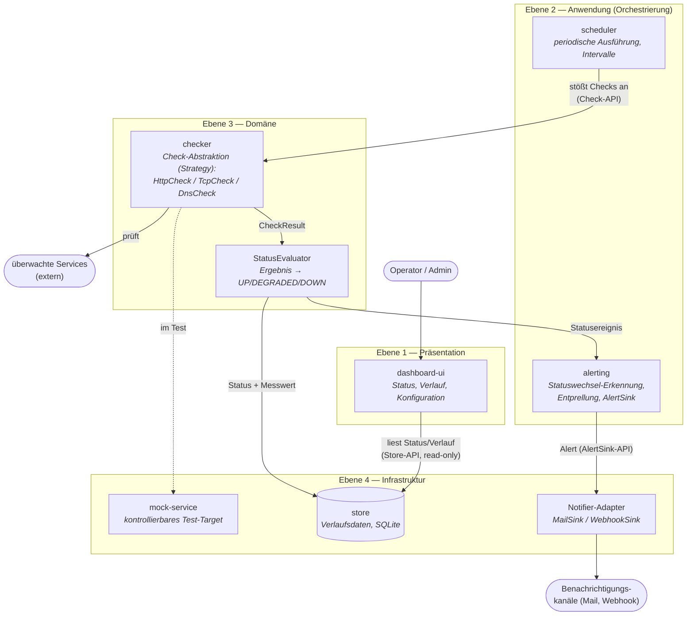

# ARC-E1 — Finale Architektur

Abgabe zur Einsendeaufgabe **ARC-E1** (Softwaretechnik). Konkreter
Architekturentwurf für das durchgängige Start-Up-Projekt
**IT-Service-Monitor** (siehe VOR-E1, AI-Coding, TST-E1, MET-E1) —
zentrales Element ist das Komponentendiagramm unten.

Repository: https://github.com/RDBHT/SWT
Pages-Reiter: https://rdbht.github.io/SWT/arc-e1.html

## 1. Das Start-Up in einem Satz

Der **IT-Service-Monitor** überwacht interne und externe Dienste periodisch
per **HTTP-, TCP- und DNS-Checks**, speichert den Verlauf und alarmiert bei
Ausfällen — Zielgruppe: kleine Teams ohne eigenes Ops-Tooling.

## 2. Komponentendiagramm

**Verteilungsschnitt:** Check-Agent (`scheduler` + `checker` + `alerting`)
und `dashboard-ui` sind getrennt deploybare Komponenten; die einzige
Koppelstelle ist die **Store-API** (Dashboard read-only). Damit können mehrere
Agenten an verschiedenen Netz-Standorten in denselben Store schreiben.

## 3. Erläuterung (Elemente der Lerneinheit ARC)

### 3.1 Verwendete Prinzipien

| Prinzip | Umsetzung im Entwurf |
|---|---|
| **Separation of Concerns / Single Responsibility** | Ein Modul = eine Verantwortung: `checker` prüft, `scheduler` taktet, `store` persistiert, `alerting` alarmiert, `dashboard-ui` zeigt an. |
| **Information Hiding** | Module kommunizieren nur über schmale Schnittstellen (Check-API, Store-API, AlertSink-API); Interna wie SQL-Schema oder HTTP-Client bleiben verborgen. |
| **Abstraktion / offen für Erweiterung** | Check-Typen als **Strategy Pattern** hinter der Check-Abstraktion — ein vierter Check-Typ (z. B. ICMP) ergänzt eine Klasse, ändert keine bestehende. Gleiches Muster bei `AlertSink` (Mail heute, Slack morgen). |
| **Dependency Injection** | Kollaborateure (`HttpProbe`, `Clock`, `AlertSink`) werden injiziert — Grundlage der Mock-Tests aus TST-E1 und der niedrigen Implementierungskopplung (vgl. MET-E1: Kopplung an Abstraktionen, bewusst akzeptiert). |
| **KISS / YAGNI** | Kein Message-Broker, kein Microservice-Zoo: zwei Deployables und eine Datei-Datenbank reichen für die Startgröße. Die Architektur startet klein, hält aber die Schnitte für spätere Skalierung offen. |

### 3.2 Ebenen

Vier Ebenen (im Diagramm als Blöcke), Abhängigkeiten zeigen **nur nach unten**:
Präsentation → Anwendung → Domäne → Infrastruktur. Die Domäne
(`checker`, `StatusEvaluator`) ist framework-frei und kennt weder UI noch
Datenbank — dadurch bleibt der Kern isoliert testbar (28 Unit-Tests in TST-E1
liefen ohne I/O).

### 3.3 Architekturstil

Kombination dreier Stile, je Aufgabe der passende:

- **Komponentenbasiert / geschichtet** als Grundgerüst (Module + Ebenen).
- **Pipe-and-Filter** für den Messpfad: `scheduler → checker →
  StatusEvaluator → store/alerting` — jede Stufe transformiert das Ergebnis
  der vorigen, zustandslos bis auf die Alert-Entprellung.
- **Client-Server** für die Auswertung: `dashboard-ui` als Client liest über
  die Store-API; der Check-Agent läuft davon unabhängig weiter (Ausfall der
  UI beeinflusst die Überwachung nicht).

### 3.4 Frameworks und Technologien

| Baustein | Technologie | Begründung |
|---|---|---|
| Module `checker`–`alerting` | **Java 17, Maven-Multi-Module** | Kontinuität zu BUI-E1/TST-E1; ein Reactor-Build für alle Module. |
| Tests | **JUnit 5, Mockito 5** | erprobt in TST-E1; DI macht die Domäne mockbar. |
| `store` | **SQLite via JDBC** | eingebettet, kein Server-Betrieb — passend zur Startgröße; hinter der Store-API austauschbar (PostgreSQL bei Wachstum). |
| `dashboard-ui` | **statisches HTML/JS** + schlanke Read-API | bewusst framework-arm (vgl. Pages-Site); kein SPA-Framework nötig. |
| Betrieb/CI | **GitHub Actions** | Build- und Qualitäts-Pipeline aus BUI-E1 wiederverwendet. |

Bewusst **kein** Spring Boot zum Start: der DI-Bedarf ist mit
Konstruktor-Injection gedeckt, das spart Startzeit, Speicher und
Framework-Kopplung. Die Ebenengrenzen erlauben eine spätere Einführung, ohne
die Domäne anzufassen.

### 3.5 Qualität und Metriken — wo und wie überwachen

Direkte Fortführung von MET-E1, verankert an zwei Stellen:

1. **CI-Quality-Gate (jeder Push, GitHub Actions):** PMD + Checkstyle mit den
   Rulesets aus [`met-e1/monitor-metrics`](../met-e1/monitor-metrics)
   (McCabe, Cognitive Complexity, NPath, Fan-Out, NCSS), dazu JaCoCo-Coverage
   und stichprobenweise PIT-Mutation-Testing (TST-E1). Schwellwerte pro Tool
   dokumentiert — MET-E1 hat gezeigt, dass Metrikwerte nur tool-spezifisch
   vergleichbar sind.
2. **Architektur-Konformität:** Die Ebenenregel („Abhängigkeiten nur nach
   unten", framework-freie Domäne) wird als Test geprüft (JDepend/ArchUnit) —
   Zyklen zwischen Modulen brechen den Build.

Beobachtungsschwerpunkt sind die aus MET-E1 bekannten Hotspots: die
Zustandslogik in `alerting` (Cognitive Complexity) und Validierungscode
(`Target`) — dort zuerst, statt flächig alles zu messen.

## 4. Abgabeform

Link auf den ARC-E1-Reiter der GitHub-Pages-Site (Diagramm dort live
gerendert): **`https://rdbht.github.io/SWT/arc-e1.html`**
