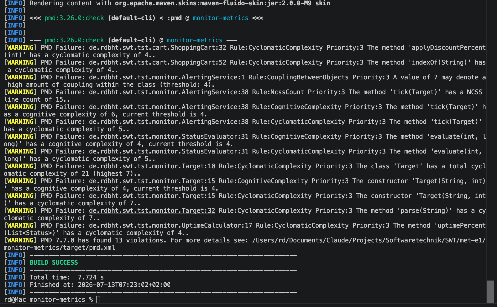
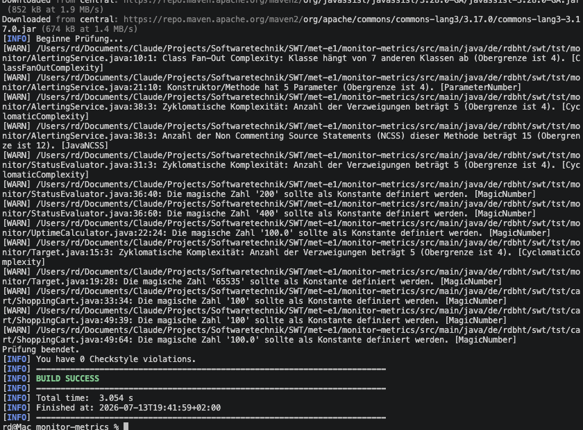

# MET-E1 — Einsendeaufgabe Metriken

Abgabe zur Einsendeaufgabe **MET-E1** (Softwaretechnik). Ziel: beweisbar
praktische Erfahrung mit **zwei Metrik-Werkzeugen** sammeln und die Ausgaben
sinnvoll interpretieren. Zusätzlich (Extrapunkte): **McCabe-Zahlen von Hand**
berechnen und mit den Tool-Ausgaben abgleichen.

Repository: https://github.com/RDBHT/SWT
Pages-Reiter: https://rdbht.github.io/SWT/met-e1.html

> **Nachweis:** Die beiden Tool-Läufe sind belegt über die committeten Roh-Reports
> unter [`reports/`](./reports) (`pmd-report.xml`, `checkstyle-result.xml`) **und** die
> Konsolen-Screenshots unter [`../docs/img/`](../docs/img) (siehe Abschnitt 3).

## 1. Werkzeugwahl

| Werkzeug | Art | Metriken |
|---|---|---|
| **PMD 7** (maven-pmd-plugin 3.26.0) | Statische Quellcode-Analyse | Zyklomatische Komplexität (McCabe), Cognitive Complexity, NPath, NCSS, Kopplung (CBO), God-Class-Erkennung (WMC/ATFD/TCC) |
| **Checkstyle 10.20** (maven-checkstyle-plugin 3.6.0) | Statische Quellcode-Analyse | Zyklomatische Komplexität, NPath, Class Fan-Out, JavaNCSS, Boolean Expression Complexity, Schachtelungstiefe + Stil-Checks |

**Begründung:** Beide sind im Aufgabentext genannt, laufen als Maven-Plugins
**ohne Installation** direkt über die Konsole (reproduzierbar, screenshot-tauglich)
und messen komplementär: PMD stärker auf Design-/Komplexitätsmetriken, Checkstyle
auf Struktur- und Stilmetriken. SonarQube wurde bewusst verworfen — der
Aufgabentext warnt selbst vor dem Installationsaufwand.

## 2. Analyseziel

Analysiert werden die **main-Sourcen aus TST-E1** (`tst-e1/monitor-test`), als
Kopie in [`monitor-metrics/`](./monitor-metrics), da abgegebene Ordner nicht
mehr verändert werden: 11 Klassen, ~300 LOC, zwei Pakete
(`monitor` = IT-Service-Monitor, `cart` = TDD-Shopping-Cart).

```
monitor-metrics/
├── pom.xml            # PMD- + Checkstyle-Plugin, failOnViolation=false
├── pmd-ruleset.xml    # Metrik-Regeln mit bewusst strengen Schwellwerten
├── checkstyle.xml     # Metrik-Checks, ebenfalls verschärft
└── src/main/java/de/rdbht/swt/tst/{monitor,cart}/
```

**Wichtig für die Interpretation:** Die Codebasis ist klein und bereits
refaktoriert. Mit den Default-Schwellwerten (z. B. McCabe > 10 pro Methode)
blieben beide Tools stumm. Die Schwellwerte wurden deshalb bewusst verschärft
(McCabe > 4, NPath > 20, Fan-Out > 4 …) — nicht, weil der Code schlecht ist,
sondern damit die **Metriken sichtbar und diskutierbar** werden.

## 3. Reproduktion (Konsole / VS Code)

```bash
cd met-e1/monitor-metrics

# PMD: Befunde auf der Konsole + target/pmd.xml
mvn pmd:check

# Checkstyle: Befunde auf der Konsole + target/checkstyle-result.xml
mvn checkstyle:check

# Alternativ HTML-Reports unter target/reports/:
mvn pmd:pmd checkstyle:checkstyle
```

`failOnViolation=false` ist gesetzt, damit ein Lauf **alle** Befunde zeigt,
statt beim ersten Fehler abzubrechen. Die Rohdaten der Läufe liegen als Beleg
in [`reports/`](./reports).

**Konsolen-Nachweis der Läufe:**





## 4. PMD-Ergebnisse und Interpretation

13 Befunde ([`reports/pmd-report.xml`](./reports/pmd-report.xml)), Auswahl:

| Fundstelle | Regel | Wert | Interpretation |
|---|---|---|---|
| `Target.<init>` | CyclomaticComplexity | **7** | Höchster Einzelwert. Ursache: Eingabevalidierung (2 `if` mit je einem `\|\|`, 2 `throw`). Kein Umbau nötig — Validierungslogik ist bewusst explizit; ein Guard-Extract würde nur Komplexität verschieben. |
| `Target.parse` | CyclomaticComplexity | **7** | `if`/`try-catch`/3×`throw` — Parsing + Validierung. PMD zählt `throw` mit (s. Abschnitt 6), daher höher als das klassische McCabe-Maß. |
| `AlertingService.tick` | CyclomaticComplexity / CognitiveComplexity / NCSS | **5 / 6 / 15** | Fachlich dichteste Methode (Zustandsmaschine der Alarmierung). Cognitive Complexity 6 > McCabe-Anteil, weil **Verschachtelung** stärker gewichtet wird — der `else-if` im `if (status == DOWN)`-Block kostet doppelt. Kandidat für Extract-Method (`handleDown()`), falls die Logik weiter wächst. |
| `AlertingService` | CouplingBetweenObjects | **7** | Bewusste Architekturentscheidung: 3 injizierte Kollaborateure (Mockbarkeit, siehe TST-E1) + Werttypen. Hohe Kopplung an **Abstraktionen**, nicht an Implementierungen → Befund akzeptiert. |
| `Target` (Klasse) | CyclomaticComplexity | **21 gesamt** | Summe über alle Methoden inkl. `equals`/`hashCode`-Boilerplate. Zeigt die Schwäche reiner Summenmetriken: Boilerplate bläht den Klassenwert auf, ohne echtes Risiko. |
| `StatusEvaluator.evaluate` | CyclomaticComplexity | **5** | Referenzfall für die Handrechnung in Abschnitt 7. |

**Nicht gefeuert:** GodClass (WMC/ATFD/TCC) — erwartbar, keine Klasse
konzentriert Verhalten und fremde Daten.

## 5. Checkstyle-Ergebnisse und Interpretation

13 Befunde ([`reports/checkstyle-result.xml`](./reports/checkstyle-result.xml)), gruppiert:

| Check | Fundstellen | Interpretation |
|---|---|---|
| CyclomaticComplexity (max 4) | `tick`=5, `evaluate`=5, `Target.<init>`=5 | Deckungsgleich mit PMD bei `tick`/`evaluate`; bei `Target.<init>` **5 statt PMD 7** → Zählweisen-Differenz, Abschnitt 6. |
| ClassFanOutComplexity (max 4) | `AlertingService`=7 | Gleiches Bild wie PMDs CBO: DI-bedingte Kopplung, akzeptiert. |
| JavaNCSS (max 12) | `tick`=15 | Konsistent mit PMD NcssCount. |
| ParameterNumber (max 4) | `AlertingService`-Konstruktor: 5 | Grenzfall: 5 Konstruktor-Parameter sind bei Constructor-Injection üblich; ab ~6 wäre ein Parameter-Objekt (z. B. `AlertPolicy` für `evaluator`+`alertAfterMs`) angemessen. |
| MagicNumber | 7× (`200`, `400`, `100`, `100.0`, `65535`) | Der nützlichste Stil-Befund: `200`/`400` (HTTP-Grenzen) und `65535` (Port-Maximum) gehören als benannte Konstanten extrahiert (`HTTP_OK_LOWER`, `MAX_PORT`). **Geplanter Fix**, kein False Positive. |

**Hinweis zur Ausgabe:** Checkstyle meldet am Ende `0 violations`, weil die
Severity auf `warning` steht — die Befunde erscheinen als `[WARN]`-Zeilen.

## 6. Toolvergleich: Warum PMD und Checkstyle verschieden zählen

Gleiche Metrik, gleicher Code, verschiedene Zahlen — `Target`-Konstruktor:
**PMD 7, Checkstyle 5**. Empirisch verifiziert mit Minimalbeispielen
(Testklasse mit isolierten Konstrukten):

| Konstrukt | PMD 7 | Checkstyle | klassisches McCabe |
|---|---|---|---|
| `if`, Schleifen, `case`, `catch`, `?:` | +1 | +1 | +1 (Entscheidungsknoten) |
| `&&`/`\|\|` **in Bedingungen** | +1 | +1 | +1 (Kurzschluss = Verzweigung) |
| `&&`/`\|\|` **in Zuweisungen** | **nicht gezählt** | +1 | +1 (Kurzschluss bleibt Verzweigung) |
| `throw` | **+1** | nicht gezählt | nicht gezählt (Exit-Punkt, kein Prädikat) |

Konsequenz: **Metrikwerte sind nur innerhalb desselben Tools (und derselben
Version) vergleichbar.** Wer Schwellwerte in CI-Gates gießt, muss die
Zählweise des konkreten Tools kennen — "McCabe 10" ist ohne Tool-Angabe
keine präzise Aussage.

## 7. Extrapunkte: McCabe von Hand

Formeln: `M = E − N + 2` (Kanten/Knoten des Kontrollflussgraphen, ein
Zusammenhangskomponent) bzw. äquivalent `M = P + 1` (P = binäre
Entscheidungspunkte inkl. Kurzschlussoperatoren).

### 7.1 `StatusEvaluator.evaluate(int, long)` — M = 5

Entscheidungspunkte: `if (responseTimeMs < 0)` (1), Kurzschluss `&&` in
`answeredOk` (2), `if (!answeredOk)` (3), ternärer Operator (4).

**M = 4 + 1 = 5.** PMD: 5 ✓ (zählt das `throw` +1, lässt dafür das `&&` in
der Zuweisung weg — gleiches Ergebnis aus anderem Grund), Checkstyle: 5 ✓.

### 7.2 `AlertingService.tick(Target)` — M = 5

Entscheidungspunkte: `if (status == DOWN)` (1), `if (downSince == null)` (2),
`else if (!alerted && …)` → Prädikat `!alerted` (3) + Kurzschluss `&&` (4).

**M = 4 + 1 = 5.** PMD: 5 ✓, Checkstyle: 5 ✓.

### 7.3 `Target.parse(String)` — M = 4, volle Graph-Rechnung

Kontrollflussgraph (Throws in gemeinsamen Exit geführt):

```
Knoten (N = 9): entry, D1[spec==null], T1[throw], D2[parts!=2], T2[throw],
                D3[parseInt ~ catch], T3[throw], R[return], exit
Kanten (E = 11): entry→D1, D1→T1, D1→D2, D2→T2, D2→D3,
                 D3→T3, D3→R, T1→exit, T2→exit, T3→exit, R→exit
```

**M = E − N + 2 = 11 − 9 + 2 = 4.** Probe über `M = P + 1`: Prädikate
`spec==null`, `parts.length!=2`, `catch` → 3 + 1 = **4** ✓.
Checkstyle: 4 (nicht gemeldet, da ≤ Schwellwert) ✓. PMD: **7**, weil die
drei `throw`-Statements mitgezählt werden — die Handrechnung zeigt, dass der
"echte" McCabe-Wert (Pfadanzahl der Basis-Pfade) bei 4 liegt.

> Optional folgt eine skizzierte CFG-Rechnung als Bild (`docs/img/met-e1-cfg.png`).

## 8. Fazit

Beide Tools identifizieren dieselben Hotspots (`AlertingService.tick`,
`Target`-Validierung) — die absolute Zahl differiert je nach Zählweise, das
**Ranking** ist stabil. Actionable waren vor allem die MagicNumber-Befunde
und die Cognitive Complexity von `tick`; die Kopplungsbefunde sind bewusste
Designentscheidungen (DI für Testbarkeit) und wurden begründet akzeptiert.
Kernerkenntnis: Metriken sind **Screening-Werkzeuge**, keine Urteile — jede
Zahl brauchte hier den Blick in den Code, um zwischen echtem Befund,
Grenzfall und False Positive zu unterscheiden.
