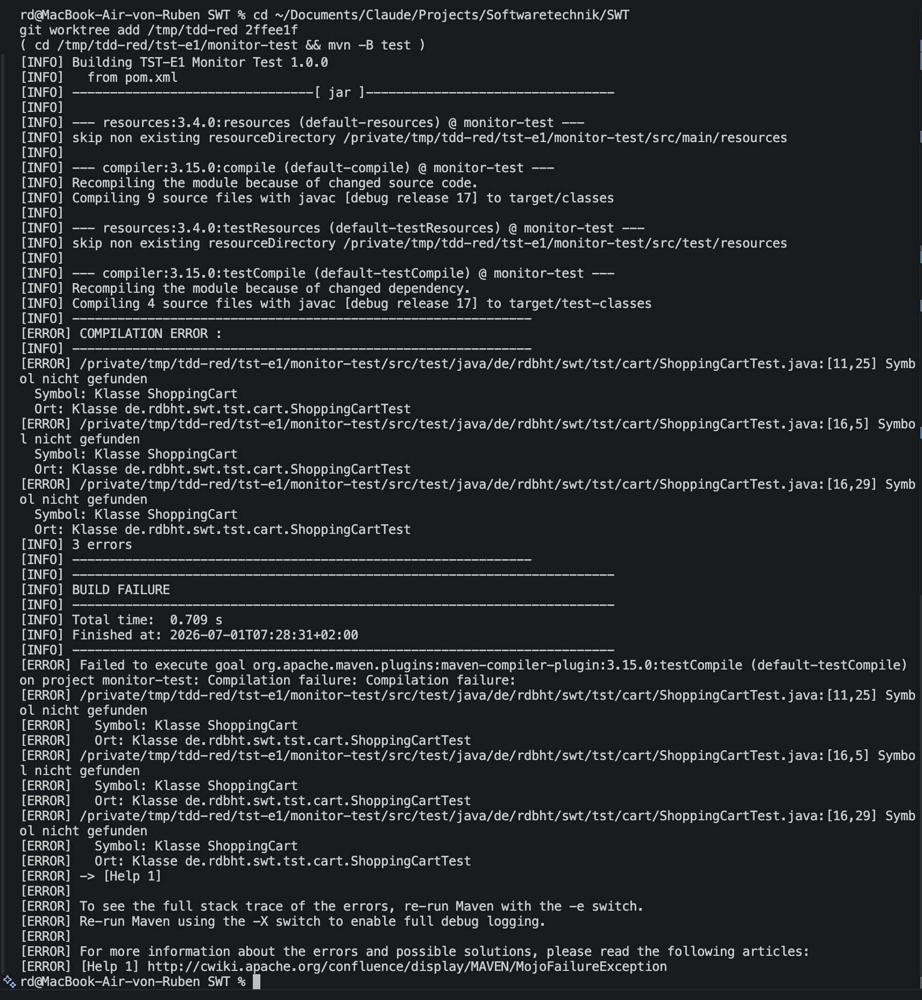
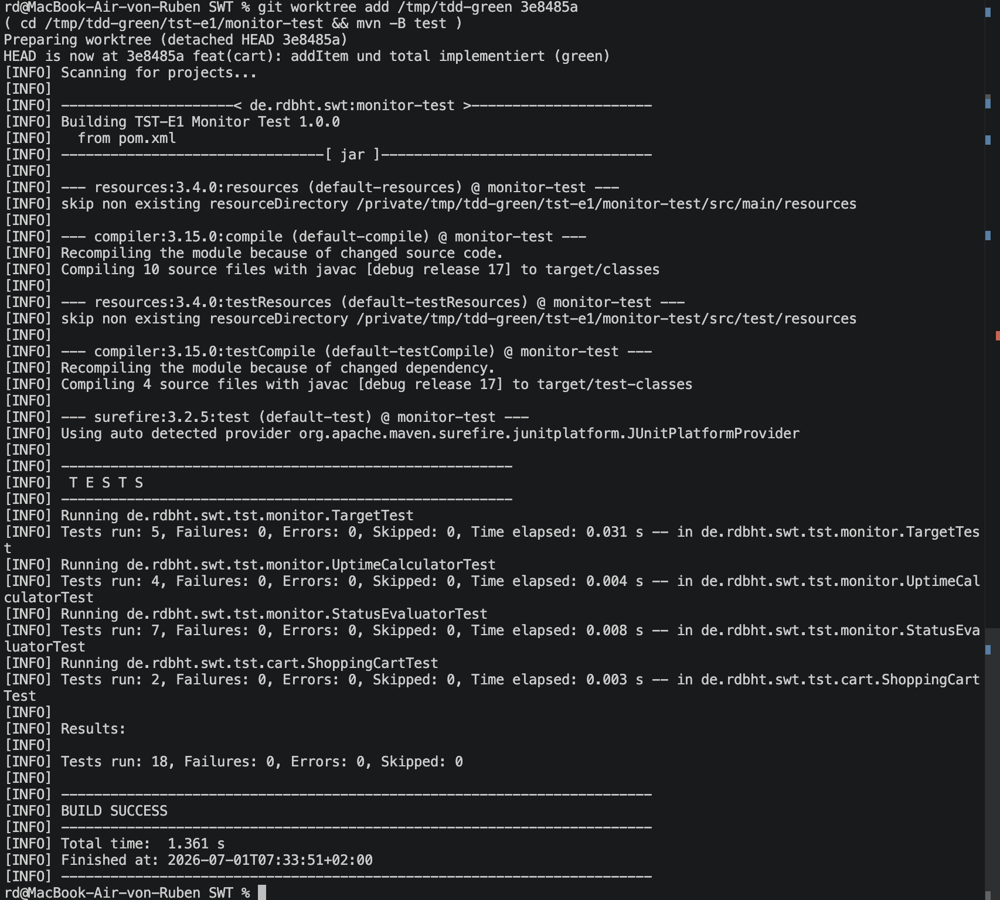

# TST-E1 — Projektaufgabe Testen

Abgabe zur Einsendeaufgabe **TST-E1** (Softwaretechnik). Praktische
Testerfahrung an einem selbst gewählten Projekt mit einer Sprache, die
**Mocking** und **Mutation Testing** unterstützt.

Repository: https://github.com/RDBHT/SWT
Pages-Reiter: https://rdbht.github.io/SWT/tst-e1.html

- **Sprache/Stack:** Java 17, Maven, JUnit 5, Mockito 5
- **Domäne:** der **IT-Service-Monitor** aus der AI-Coding-Aufgabe
  (HTTP/TCP/DNS-Health-Checks, Status, Alerting) — plus ein eigenständiger
  Shopping-Cart für den TDD-Teil
- **Projektordner:** [`monitor-test/`](./monitor-test)

```
monitor-test/
├── pom.xml
└── src/
    ├── main/java/de/rdbht/swt/tst/
    │   ├── monitor/   StatusEvaluator, Target, UptimeCalculator,
    │   │              AlertingService + Mock-Kollaborateure (HttpProbe, Clock, AlertSink)
    │   └── cart/      ShoppingCart, LineItem        (per TDD entstanden)
    └── test/java/de/rdbht/swt/tst/
        ├── monitor/   StatusEvaluatorTest, TargetTest, UptimeCalculatorTest, AlertingServiceTest
        └── cart/      ShoppingCartTest
```

Gesamtstand: **28 Tests, alle grün** (`Tests run: 28, Failures: 0, Errors: 0`).

## Bauen und Testen

```bash
cd tst-e1/monitor-test
mvn -B test          # kompiliert + führt alle JUnit-5-Tests aus
```

**Lokaler Testlauf-Nachweis:** [`local-test-run.md`](./local-test-run.md) (28 Tests grün, BUILD SUCCESS).

> Build-Umgebung ohne Maven/JDK 17? Setup analog zu BUI-E1: Temurin-JDK-17- und
> Maven-3.9.9-Tarball ins Home entpacken, `JAVA_HOME`/`PATH` setzen, dann `mvn`.

---

## Teil 1 — Unit-Tests für eigenen Code (inkl. Exception)

Reine, deterministische Monitor-Logik ohne I/O:

| Klasse | Verantwortung | Tests |
|---|---|---|
| `StatusEvaluator` | HTTP-Code + Antwortzeit → `UP`/`DEGRADED`/`DOWN` | 7, davon 2 Exception |
| `Target` | `parse("host:port")` mit Validierung | 5, davon 3 Exception |
| `UptimeCalculator` | SLA-Prozent über ein Fenster | 4, davon 1 Exception |

### Dateien im Überblick (Teil 1)

Basis-URL der Dateien: `tst-e1/monitor-test/src/…`. Direktlinks (main):

| Datei | Rolle | Link |
|---|---|---|
| `Status.java` | Enum der drei Health-Check-Zustände `UP` / `DEGRADED` / `DOWN`. | [main/…/monitor/Status.java](https://github.com/RDBHT/SWT/blob/main/tst-e1/monitor-test/src/main/java/de/rdbht/swt/tst/monitor/Status.java) |
| `StatusEvaluator.java` | Reine Entscheidungslogik: HTTP-Code + Antwortzeit → `Status`. Wirft `IllegalArgumentException` bei nicht-positivem Schwellwert oder negativer Antwortzeit. | [StatusEvaluator.java](https://github.com/RDBHT/SWT/blob/main/tst-e1/monitor-test/src/main/java/de/rdbht/swt/tst/monitor/StatusEvaluator.java) |
| `Target.java` | Überwachtes Ziel (`host:port`). `parse()` validiert die Eingabe und wirft bei fehlendem Port / falschem Bereich `IllegalArgumentException`. | [Target.java](https://github.com/RDBHT/SWT/blob/main/tst-e1/monitor-test/src/main/java/de/rdbht/swt/tst/monitor/Target.java) |
| `UptimeCalculator.java` | SLA-Verfügbarkeit in Prozent über ein Fenster; `DEGRADED` zählt als verfügbar; leeres Fenster → `IllegalArgumentException`. | [UptimeCalculator.java](https://github.com/RDBHT/SWT/blob/main/tst-e1/monitor-test/src/main/java/de/rdbht/swt/tst/monitor/UptimeCalculator.java) |
| `StatusEvaluatorTest.java` | 7 Tests (UP/DEGRADED/DOWN, Schwellwert-Grenze) inkl. **2 Exception-Tests**. | [StatusEvaluatorTest.java](https://github.com/RDBHT/SWT/blob/main/tst-e1/monitor-test/src/test/java/de/rdbht/swt/tst/monitor/StatusEvaluatorTest.java) |
| `TargetTest.java` | 5 Tests (Parsing, Host/Port) inkl. **3 Exception-Tests**. | [TargetTest.java](https://github.com/RDBHT/SWT/blob/main/tst-e1/monitor-test/src/test/java/de/rdbht/swt/tst/monitor/TargetTest.java) |
| `UptimeCalculatorTest.java` | 4 Tests (100 %, DEGRADED zählt, 75 %) inkl. **1 Exception-Test**. | [UptimeCalculatorTest.java](https://github.com/RDBHT/SWT/blob/main/tst-e1/monitor-test/src/test/java/de/rdbht/swt/tst/monitor/UptimeCalculatorTest.java) |

Die geforderten **Exception-Tests** prüfen mit `assertThrows(IllegalArgumentException.class, …)`
z. B. einen nicht-positiven Schwellwert (`new StatusEvaluator(0)`), eine ungültige
Target-Angabe (`Target.parse("example.com")` ohne Port) und ein leeres Uptime-Fenster.

## Teil 2 — TDD Shopping Cart (Git-History ist die Abgabe)

Bewertet wird der **Weg**, nicht der Endzustand. Jedes Feature wurde strikt im
Zyklus **red → green → refactor** als je ein Commit mit Zeitstempel entwickelt.
Die „roten" Commits scheitern bewusst (Test referenziert noch nicht existierenden
Code → Compile-Fehler), die „grünen" machen sie bestehen, die „refactor"-Commits
verbessern die Struktur bei unverändert grünen Tests.

Vier Features → 12 Commits:

```
test(cart): addItem/total — leerer Korb und Summe (red)
feat(cart): addItem und total implementiert (green)
refactor(cart): LineItem-Record extrahiert, drei Listen zu einer (refactor)
test(cart): removeItem entfernt Position aus der Summe (red)
feat(cart): removeItem implementiert (green)
refactor(cart): lineByName-Helfer für Positionssuche extrahiert (refactor)
test(cart): updateQuantity berechnet Summe neu, lehnt ungültige Werte ab (red)
feat(cart): updateQuantity implementiert inkl. Validierung (green)
refactor(cart): Positionssuche in indexOf gebündelt (refactor)
test(cart): applyDiscountPercent rabattiert Summe, lehnt ungültige Prozente ab (red)
feat(cart): applyDiscountPercent implementiert (green)
refactor(cart): gross() und applyDiscount() extrahiert (refactor)
```

**Eigene rot/grün-Läufe (Nachweis).** Direkt aus der Historie ausgecheckt, Feature `addItem`:

| Schritt | Commit | Screenshot |
|---|---|---|
| red — Test vor Implementierung, Compile-Fehler → BUILD FAILURE | `2ffee1f` |  |
| green — minimale Implementierung → BUILD SUCCESS | `3e8485a` |  |

Den Ablauf nachvollziehen:

```bash
git log --oneline --grep '(cart)'          # die 12 Schritte
git show <red-commit>                       # zeigt: nur ein neuer, scheiternder Test
```

## Teil 3 — Mocking (gewählte Variante)

> Gewählt wurde **Variante 3 (Mocking)** statt Variante 4 (Mutation Testing).
> Begründung siehe unten und [ADR-0001](../docs/adr/0001-mocking-statt-mutation-testing.md).

`AlertingService` ist die Kernlogik: pro `tick(target)` wird der Service geprobt,
der Status bewertet und **erst nach einem Ausfallfenster** (z. B. 5 min) ein Alarm
ausgelöst. Die drei „unangenehmen" Abhängigkeiten werden per Constructor-Injection
gemockt:

- `HttpProbe` — der **Netzwerk-Request** (langsam, nicht-deterministisch, extern)
- `Clock` — die **Systemzeit** (lässt sich real nicht steuern)
- `AlertSink` — der **Alarm-Versand** (soll im Test nichts verschicken)

Mockito stellt das Verhalten der Probe (`when(probe.probe(t)).thenReturn(...)`)
und der Uhr (`when(clock.nowMillis()).thenReturn(0L, 60_000L, 300_000L, 360_000L)`)
und prüft mit `verify(sink, times(1)).fire(...)`, dass der Alarm **genau einmal**
nach Überschreiten des Fensters feuert.

### Warum genau diese Methoden gemockt werden mussten (2–3 Sätze)

Ein Monitoring-Tool besteht im Kern aus genau diesen Effekten: Netzwerk, Zeit und
Benachrichtigung. Ein echter `HttpProbe` öffnet einen Socket — das ist langsam,
flaky und vom Zustand fremder Systeme abhängig; und eine „Alarm erst nach 5 Minuten
Ausfall"-Regel wäre mit echter Uhr nur in Echtzeit testbar. Durch das Mocken von
Probe und `Clock` wird der Test deterministisch, läuft offline in Mikrosekunden und
prüft ausschließlich die Alarm-Logik — ohne echten Alarm zu versenden.

### Warum nicht Mutation Testing (Variante 4)

Mutation Testing (z. B. PIT) bewertet die **Güte vorhandener Tests**, indem es den
Produktivcode mutiert und prüft, ob Tests anschlagen. Das setzt deterministisch
testbaren Code voraus — es **löst aber das Kernproblem dieser Domäne nicht**: die
externen, nicht-deterministischen Abhängigkeiten. Genau die handhabt Mocking, und
ohne Mocking ließe sich die Alerting-Logik gar nicht erst isoliert testen. Mocking
ist hier also der didaktisch wie fachlich passendere Hebel; PIT wäre ein sinnvoller
**nächster** Schritt auf den bereits deterministischen Teil-1-Klassen.
