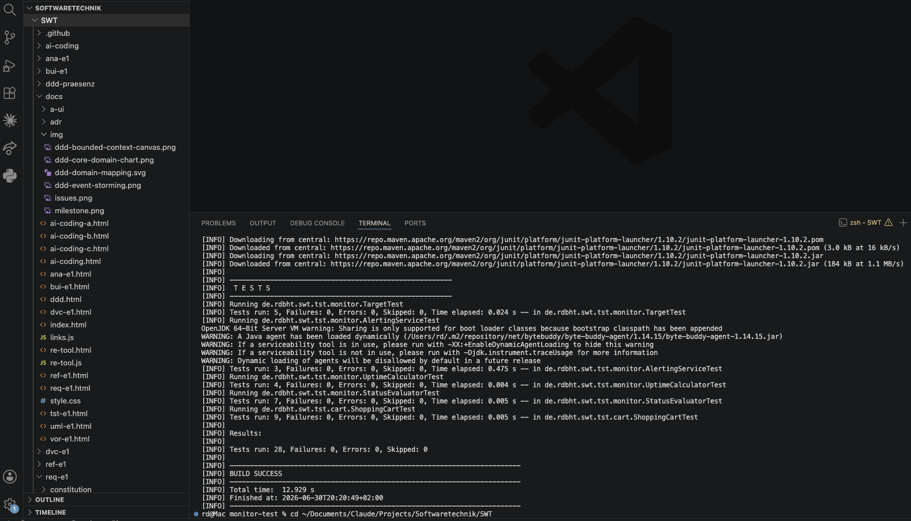

# TST-E1 — Lokaler Testlauf (Nachweis)

Belegt, dass die Testsuite **lokal auf macOS** ausgeführt wurde und grün ist.

- **Datum:** 2026-06-30, 20:20 (Europe/Berlin)
- **Umgebung:** macOS, Maven (Homebrew), JDK ≥ 17, Mockito 5.12 / JUnit 5
- **Befehl:** `cd tst-e1/monitor-test && mvn -B test`
- **Ergebnis:** `Tests run: 28, Failures: 0, Errors: 0, Skipped: 0` → **BUILD SUCCESS**

<!-- Optionaler Screenshot: Terminal-Foto als docs/img/tst-e1-local-test.png ablegen
     und die folgende Zeile einkommentieren, dann wird es hier eingebunden: -->
<!--  -->

## Konsolenausgabe (Auszug)

```
[INFO] -------------------------------------------------------
[INFO]  T E S T S
[INFO] -------------------------------------------------------
[INFO] Running de.rdbht.swt.tst.monitor.TargetTest
[INFO] Tests run: 5, Failures: 0, Errors: 0, Skipped: 0, Time elapsed: 0.024 s -- in de.rdbht.swt.tst.monitor.TargetTest
[INFO] Running de.rdbht.swt.tst.monitor.AlertingServiceTest
[INFO] Tests run: 3, Failures: 0, Errors: 0, Skipped: 0, Time elapsed: 0.475 s -- in de.rdbht.swt.tst.monitor.AlertingServiceTest
[INFO] Running de.rdbht.swt.tst.monitor.UptimeCalculatorTest
[INFO] Tests run: 4, Failures: 0, Errors: 0, Skipped: 0, Time elapsed: 0.004 s -- in de.rdbht.swt.tst.monitor.UptimeCalculatorTest
[INFO] Running de.rdbht.swt.tst.monitor.StatusEvaluatorTest
[INFO] Tests run: 7, Failures: 0, Errors: 0, Skipped: 0, Time elapsed: 0.005 s -- in de.rdbht.swt.tst.monitor.StatusEvaluatorTest
[INFO] Running de.rdbht.swt.tst.cart.ShoppingCartTest
[INFO] Tests run: 9, Failures: 0, Errors: 0, Skipped: 0, Time elapsed: 0.005 s -- in de.rdbht.swt.tst.cart.ShoppingCartTest
[INFO]
[INFO] Results:
[INFO]
[INFO] Tests run: 28, Failures: 0, Errors: 0, Skipped: 0
[INFO]
[INFO] ------------------------------------------------------------------------
[INFO] BUILD SUCCESS
[INFO] ------------------------------------------------------------------------
[INFO] Total time:  12.929 s
[INFO] Finished at: 2026-06-30T20:20:49+02:00
[INFO] ------------------------------------------------------------------------
```
