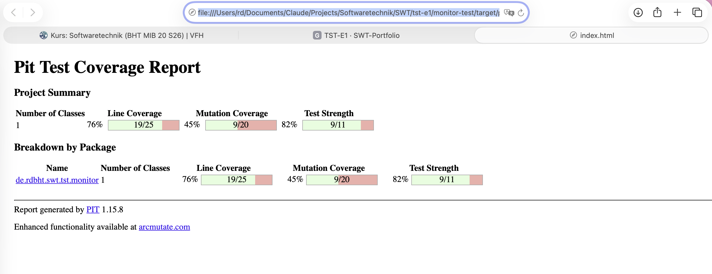

# Mutation Testing mit PIT — kleines Beispiel (Variante 4)

Kurzes Zusatzbeispiel neben der gewählten Variante 3 (Mocking). **PIT** wird auf
**eine** Klasse losgelassen: `Target`.

- **Werkzeug:** `pitest-maven` 1.15.8 + `pitest-junit5-plugin` 1.2.1
- **Aufruf:** `cd tst-e1/monitor-test && mvn -B clean test org.pitest:pitest-maven:mutationCoverage`
- **Report (lokal):** `target/pit-reports/index.html`

## Ergebnis (mit den vorhandenen 5 `Target`-Tests)

20 Mutanten, **9 getötet (45 %)**, Test-Stärke 82 %. Mehrere Mutanten überleben,
weil `equals` / `hashCode` / `toString` und die exakten Port-Grenzen nicht
geprüft werden — eine Lücke, die reine Zeilen-Coverage nicht zeigt.

> Nachweis des **lokalen** Laufs: Screenshot der PIT-Konsolenausgabe bzw. des
> Reports `target/pit-reports/index.html`. Datei: `docs/img/tdd-mutation.png`.

## Drei überlebende Mutanten — Bedeutung und tötender Test

1. **`ConditionalsBoundaryMutator` auf `port > 65535` (Konstruktor).**
   Der Mutant verschiebt die Grenze (`>` → `>=`), sodass der gültige Grenzport
   **65535** fälschlich abgelehnt würde. Überlebt, weil nur ein viel zu großer
   Port (70000) getestet ist, nicht die Grenze selbst.
   *Tötender Test:* `assertEquals(65535, new Target("h", 65535).port());`

2. **`EmptyObjectReturnValsMutator` auf `toString()`.**
   Der Mutant ersetzt den Rückgabewert durch `""`. Überlebt, weil kein Test
   `toString()` prüft.
   *Tötender Test:* `assertEquals("h:80", new Target("h", 80).toString());`

3. **`PrimitiveReturnsMutator` auf `hashCode()`.**
   Der Mutant lässt `hashCode()` konstant `0` liefern. Überlebt, weil kein Test
   `hashCode()` prüft.
   *Tötender Test:* zwei unterschiedliche Targets müssen unterschiedliche Hashes
   liefern: `assertNotEquals(new Target("h",1).hashCode(), new Target("h",2).hashCode());`

## Fazit

Mutation Testing deckt Testlücken auf, die Zeilen-Coverage verbirgt (Grenzwerte,
ungetestete `equals`/`hashCode`/`toString`). Die drei genannten Zusatztests
würden die Mutanten töten.
